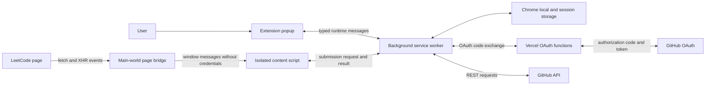
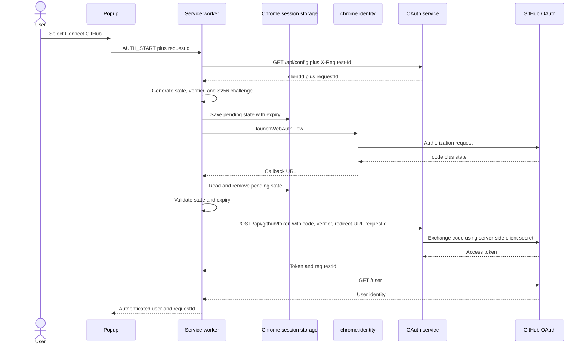
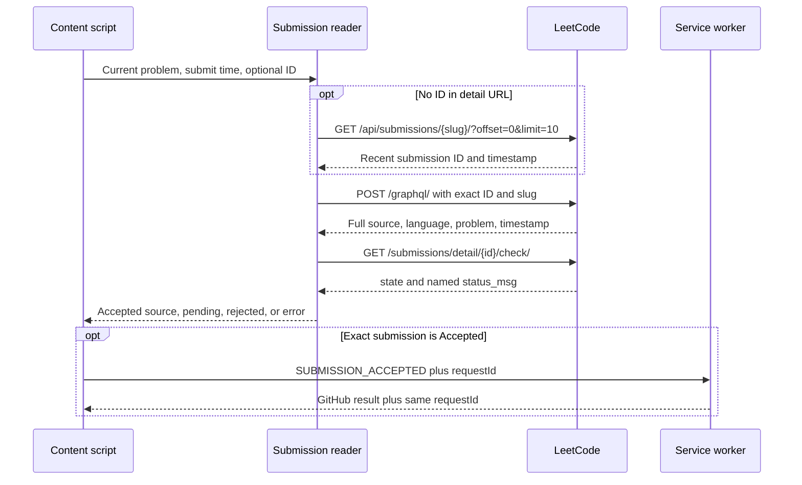

# Architecture

## Components



The main-world bridge can observe LeetCode's own network calls but has no extension privileges. The isolated content script can use Chrome APIs but never receives the GitHub token. The service worker is the only extension component that authenticates or writes to GitHub. The same OAuth handler runs behind three Vercel function entries and the local Node server.

## GitHub authentication flow



## Accepted-submission flow

```mermaid
sequenceDiagram
    actor User
    participant Page as LeetCode page
    participant Bridge as Main-world bridge
    participant Content as Content script
    participant Worker as Service worker
    participant Storage as Chrome storage
    participant GitHub as GitHub API

    User->>Page: Submit code
    Bridge->>Bridge: Capture typed_code and lang from submit request
    Page-->>Bridge: Submit response with submission_id
    Bridge->>Bridge: Associate full source with submission_id
    Page-->>Bridge: Accepted check response
    Bridge->>Bridge: Match check URL to captured submission_id
    Bridge->>Content: SUBMISSION_ACCEPTED window message
    Content->>Content: Combine network data and DOM metadata
    Content->>Worker: SUBMISSION_ACCEPTED with requestId
    Worker->>Worker: Validate sender and payload
    Worker->>Storage: Read token, repository, settings, history
    Worker->>GitHub: GET destination file
    alt Existing content is identical
        Worker->>Storage: Record fingerprint and skipped history
        Worker-->>Content: SKIPPED_DUPLICATE with requestId
    else New or changed content
        Worker->>GitHub: PUT solution with current SHA when updating
        alt GitHub reports stale SHA
            Worker->>GitHub: GET current file
            Worker->>GitHub: PUT once with refreshed SHA
        end
        opt README enabled
            Worker->>GitHub: GET and conditionally PUT problem README
        end
        Worker->>Storage: Record fingerprint and successful history
        Worker-->>Content: SYNC_SUCCESS with requestId
    end
    Content-->>User: Result notification with requestId
```



Results matching a captured Submit request trigger synchronization. The content script also watches Submit clicks and Ctrl/Cmd+Enter. Without a bridge result, it finds a new submission ID from the detail URL or the authenticated per-problem submission list, queries GraphQL for the full judged source, and validates its problem slug and freshness using LeetCode's server clock. It verifies the named verdict for that exact ID through the check endpoint, not a numeric GraphQL status code. Only Accepted is sent to the worker; pending results retry, rejected results display their actual verdict, and unverifiable results produce an error. Duplicate submission IDs are ignored. Test runs and previously viewed results do not trigger synchronization. Rendered editor lines can contain only part of the file and are never used as source. The worker rejects messages without a submission ID so tabs still running the original content script must be refreshed before writing.

### Recovery request trace



Waiting and saving notifications remain visible until a final result replaces them. Recovery has a five-minute limit; a worker reply has a two-minute timeout that tells the user to inspect history before retrying because a late write may still finish. If Chrome invalidates the content script after an extension reload, it stops recovery and shows refresh instructions once.

## OAuth HTTP routes

| Method | Route | Input | Output |
|---|---|---|---|
| `GET` | `/health` locally or `/api/health` on Vercel | Optional `X-Request-Id` | Health and configured state |
| `GET` | `/api/config` | Allowed extension ID, matching Origin if present | Public GitHub OAuth Client ID |
| `POST` | `/api/github/token` | Code, PKCE verifier, redirect URI | Access token or classified error |
| `OPTIONS` | OAuth routes | CORS preflight | Allowed origin and headers |

Each response includes `X-Request-Id`. Each completed request produces a JSON log containing request ID, method, path, status, outcome, and duration.

Background OAuth requests send `X-LeetSync-Extension-Id` because extension requests can omit Origin. The server checks that ID against the allowlist and rejects mismatched origins or callbacks. These headers do not authenticate a user; GitHub's code exchange and PKCE checks establish authorization. The handler accepts both Node request streams and bodies already parsed by Vercel.

## Internal message contract

```json
{
  "type": "SUBMISSION_ACCEPTED",
  "requestId": "20c1ff07-40f0-46ad-992d-9fdd70ef5849",
  "payload": {
    "submissionId": "123456789",
    "problemSlug": "two-sum",
    "problemId": "1",
    "title": "Two Sum",
    "language": "cpp",
    "code": "class Solution { ... }",
    "url": "https://leetcode.com/problems/two-sum/"
  }
}
```

The response preserves `requestId` and contains `success`, an outcome `type`, and either a result message or an error. Successful results, including identical-content skips, include the repository, file path, and GitHub URL. These fields are also recorded in history.

## Correctness model

1. Per-problem in-memory queues prevent overlapping work during one service-worker lifetime.
2. GitHub is read before each write, making current repository content authoritative.
3. Identical normalized content returns a successful no-op.
4. Updates include GitHub's current content SHA.
5. One conflict causes one refresh and one retry; further conflicts are reported.
6. Local fingerprints and bounded history are observability aids, not the authoritative duplicate decision.

## Security boundaries

- OAuth client secret: OAuth service environment only.
- GitHub token: background worker and extension storage only.
- LeetCode page bridge: submission data only, no Chrome APIs or credentials.
- Content script: page metadata and runtime messaging, no token access.
- OAuth origin allowlist: configured Chrome extension IDs only.
